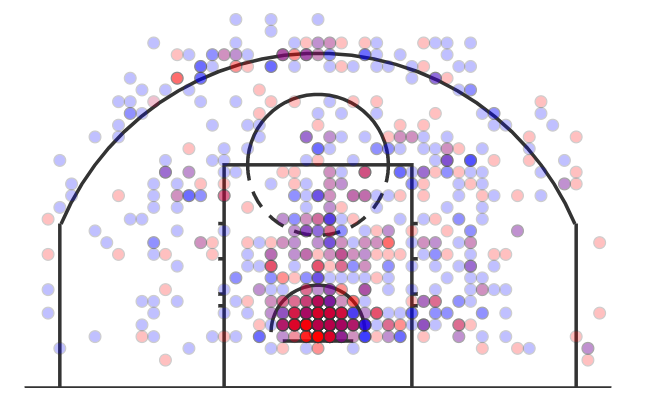
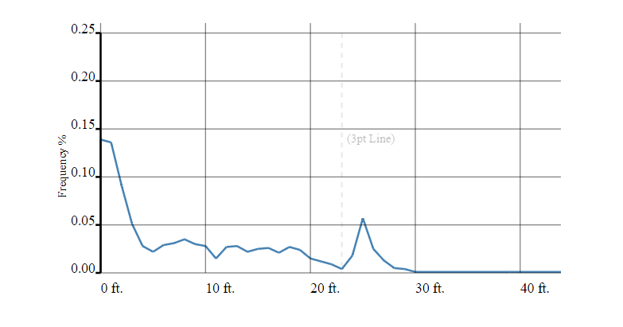
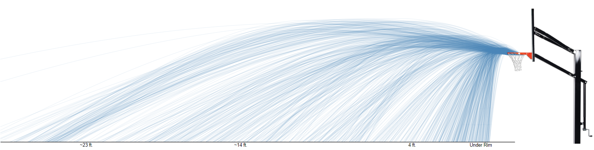
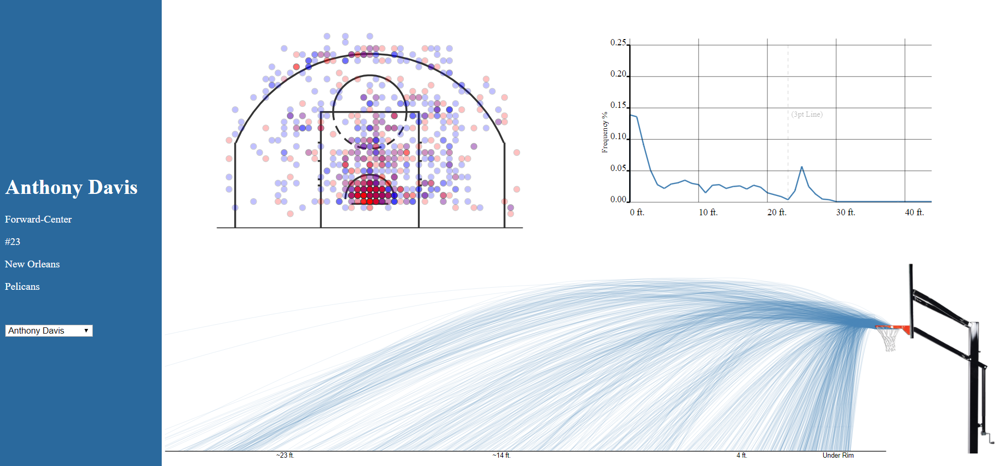

# J-stroke _A new way to think about NBA Players_
_J-stroke is a project undertaken to examine the current methods of basketball player evaluations and is a data visualization tool to complement currently used methods. The developers were very interested in building a tool that not only communicates the playing style and patters of a player, but also helps compare different players with different playing styles._

#### Developers: Michael Krebs and Harsh Rana 
[Link to project](https://hr23232323.github.io/final/)

---

# The Design
We started out by creating a single view dashboard containing the shot chart for a specific player. We utilized a single visual encoding channel, color, to showcase the field goal percent and used aggregation to combine similar shots together. Our shot chart can be see below-

      

Next, we built the frequncy chart of field goal percentage and distance. This chart can be seen below-

      

Finally, after exploring D3 techniques like line interpolations, seeded randomness, and arcs, we built the shot path/curve chart which can be seen below-

      

All these charts worked really well together with the shot chart being highly visual, the frequency chart being highly quantitative and the shit curve chart combining the two concepts. Our final dashboard can be seen below-

      

## Achievements
W went above and beyond in this project, both from technical and design standpoints as shown below-

### Technical
Here's a description of our Technical Achievements for this project.
- ****: 

 

### Design
Here's a description of our Design Achievements for this project.
- ****:
